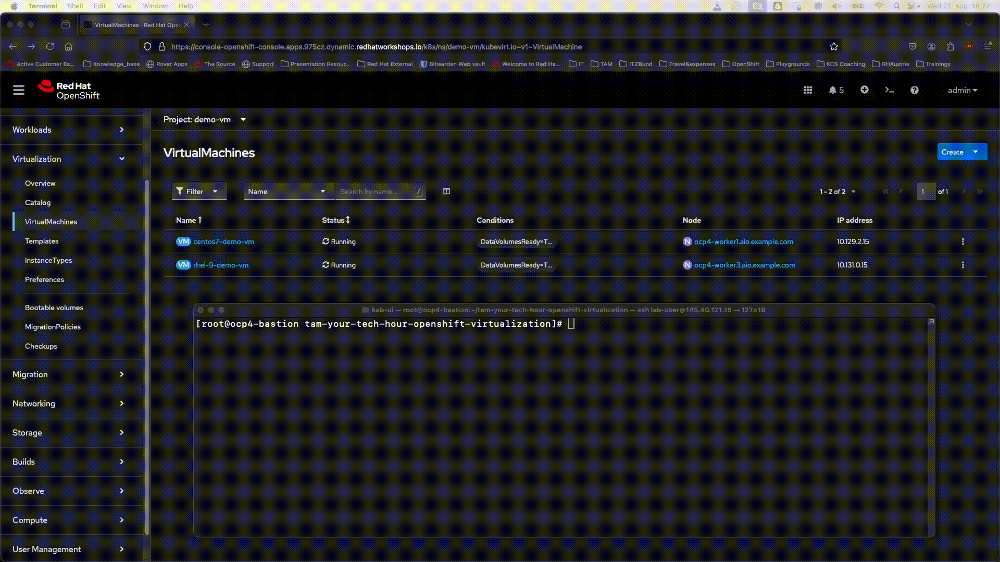

- [TAM your tech hour - OpenShift Virtualization](#tam-your-tech-hour---openshift-virtualization)
  - [Webinar facts](#webinar-facts)
- [Webinar content](#webinar-content)
  - [Create VMs](#create-vms)
    - [Create VMs with the CLI](#create-vms-with-the-cli)
    - [Create VMs with the GUI](#create-vms-with-the-gui)
  - [Migrate VMs](#migrate-vms)
    - [Migrate VMs with the CLI](#migrate-vms-with-the-cli)
    - [Migrate VMs with the GUI](#migrate-vms-with-the-gui)
  - [Delete VMs](#delete-vms)
    - [Delete VMs via CLI](#delete-vms-via-cli)
    - [Delete VMs via GUI](#delete-vms-via-gui)
  - [Snapshot and Restore](#snapshot-and-restore)
    - [Snapshot](#snapshot)
    - [Restore](#restore)
  - [Leverage OpenShift Features](#leverage-openshift-features)
    - [Services](#services)
    - [Routes](#routes)
    - [Health Checks](#health-checks)

**Disclaimer: Due to the amount of GIFs in this README, the page might take some time to fully load all content. You can inspect the GIFs individually (and with better resolution) in `src/video`.**

# TAM your tech hour - OpenShift Virtualization

Content of the TAM your tech hour webinar about OpenShift Virtualization: [Modernize your virtualization strategy with Red Hat OpenShift](https://www.redhat.com/en/events/webinar/tam-your-tech/modernise-virtualisation-strategy-red-hat-openshift-2024). 

## Webinar facts

- Link: [Modernize your virtualization strategy with Red Hat OpenShift](https://www.redhat.com/en/events/webinar/tam-your-tech/modernise-virtualisation-strategy-red-hat-openshift-2024)
- Date: September 24, 2024, 10:00 a.m. CEST (UTC+ 2)
- Contributor: [Amr Elganzory](https://github.com/AmrGanz), [Kevin Niederwanger](https://github.com/Skalador)

# Webinar content

To Provision the setup:

```sh
# OpenShift Virtualization
oc create -f operators/virtualization/operator-virtualization.yaml
# HyperConvergedController CR
oc apply -f operators/virtualization/hyperconverged.yaml
```

## Create VMs

This activity will be performed in the `demo-vm` project, which does not exist yet.
```sh
$ oc new-project demo-vm
```

### Create VMs with the CLI

Create a VM from the provided demo VMs, i.e with a preconfigured YAML file.
```sh
$ oc create -f vms/virtualmachine-1.yaml 
virtualmachine.kubevirt.io/demo-vm-1 created
```

Alternatively the `virtctl` tool can be used to create a VM, e.g:
```sh
$ virtctl create vm \
--name=fedora-plum-sailfish-86 \
--instancetype=u1.medium \
--preference=fedora \
--volume-datasource=src:openshift-virtualization-os-images/fedora \
--cloud-init-user-data I2Nsb3VkLWNvbmZpZwpjaHBhc3N3ZDoKICBleHBpcmU6IGZhbHNlCnBhc3N3b3JkOiA0b2htLTlnZDctZzE4OAp1c2VyOiBmZWRvcmEK
```


### Create VMs with the GUI


## Migrate VMs

This activity will be performed in the `demo-vm` project.
```sh
$ oc project demo-vm
```

### Migrate VMs with the CLI

Migrate the `rhel-9-demo-vm` from `ocp4-worker2.aio.example.com` to `ocp4-worker3.aio.example.com` via the CLI:
```sh
$ oc get vmi
NAME              AGE     PHASE     IP            NODENAME                       READY
centos7-demo-vm   18m     Running   10.129.2.15   ocp4-worker1.aio.example.com   True
demo-vm-1         30m     Running   10.128.2.33   ocp4-worker2.aio.example.com   True
rhel-9-demo-vm    2m16s   Running   10.128.2.42   ocp4-worker2.aio.example.com   True

$ virtctl migrate rhel-9-demo-vm 
VM rhel-9-demo-vm was scheduled to migrate

$ oc get vmim
NAME                        PHASE       VMI
kubevirt-migrate-vm-kdqdz   Succeeded   rhel-9-demo-vm

$ oc get vmi
NAME              AGE     PHASE     IP            NODENAME                       READY
centos7-demo-vm   19m     Running   10.129.2.15   ocp4-worker1.aio.example.com   True
demo-vm-1         31m     Running   10.128.2.33   ocp4-worker2.aio.example.com   True
rhel-9-demo-vm    2m58s   Running   10.131.0.15   ocp4-worker3.aio.example.com   True
```


### Migrate VMs with the GUI


## Delete VMs

This activity will be performed in the `demo-vm` project.
```sh
$ oc project demo-vm
```

### Delete VMs via CLI

```sh
$ oc get vm
NAME              AGE   STATUS    READY
centos7-demo-vm   25m   Running   True
rhel-9-demo-vm    28m   Running   True


$ oc delete vm centos7-demo-vm
virtualmachine.kubevirt.io "centos7-demo-vm" deleted
```



### Delete VMs via GUI


## Snapshot and Restore

This activity will be performed in the `demo-vm` project.
```sh
$ oc project demo-vm
```

### Snapshot


### Restore


## Leverage OpenShift Features 

OpenShift Virtualization can use standard OpenShift features, such as
- `Services` 
- `Routes` 
- `LivenessProbes`
- `ReadinessProbes`

To showcase this behavior, create a new project called `vm-feature-showcase` and deploy all objects from the `vms/` folder.

```sh
$ oc new-project vm-feature-showcase

$ oc create -f vms/
route.route.openshift.io/my-route created
service/my-service created
virtualmachine.kubevirt.io/demo-vm-1 created
virtualmachine.kubevirt.io/demo-vm-2 created
```

This will deploy the  following components:
- Virtual machine 1 --> First web server VM
- Virtual machine 2 --> Second web server VM
- `service` --> Enables the connection to all VMs
- `route` --> Enables HTTP(S) traffic to the VMs via the `service`

```sh
$ oc get all
NAME                                READY   STATUS    RESTARTS   AGE
pod/virt-launcher-demo-vm-1-5wkgj   1/1     Running   0          6m
pod/virt-launcher-demo-vm-2-rmbzq   1/1     Running   0          5m59s

NAME                 TYPE        CLUSTER-IP       EXTERNAL-IP   PORT(S)    AGE
service/my-service   ClusterIP   172.30.228.202   <none>        8080/TCP   6m1s

NAME                                HOST/PORT                                                            PATH   SERVICES     PORT   TERMINATION   WILDCARD
route.route.openshift.io/my-route   my-route-vm-feature-showcase.apps.975cz.dynamic.redhatworkshops.io          my-service   8080                 None

NAME                                             PHASE       PROGRESS   RESTARTS   AGE
datavolume.cdi.kubevirt.io/demo-vm-1-ds-fedora   Succeeded   100.0%                6m1s
datavolume.cdi.kubevirt.io/demo-vm-2-ds-fedora   Succeeded   100.0%                6m1s

NAME                                           AGE   PHASE     IP            NODENAME                       READY
virtualmachineinstance.kubevirt.io/demo-vm-1   6m    Running   10.128.2.17   ocp4-worker2.aio.example.com   True
virtualmachineinstance.kubevirt.io/demo-vm-2   6m    Running   10.129.2.8    ocp4-worker1.aio.example.com   True

NAME                                   AGE    STATUS    READY
virtualmachine.kubevirt.io/demo-vm-1   6m1s   Running   True
virtualmachine.kubevirt.io/demo-vm-2   6m1s   Running   True
```

### Services

The IPs of the `virt-launcher-` are `10.128.2.17` and `10.129.2.8`
```sh
$ oc get pods -owide
NAME                            READY   STATUS    RESTARTS   AGE   IP            NODE                           NOMINATED NODE   READINESS GATES
virt-launcher-demo-vm-1-5wkgj   1/1     Running   0          11m   10.128.2.17   ocp4-worker2.aio.example.com   <none>           1/1
virt-launcher-demo-vm-2-rmbzq   1/1     Running   0          11m   10.129.2.8    ocp4-worker1.aio.example.com   <none>           1/1
```

Both `virt-launcher-` pods are attached to the same service called `my-service` with port `8080`
```sh
$ oc get endpoints
NAME         ENDPOINTS                          AGE
my-service   10.128.2.17:8080,10.129.2.8:8080   11m
```

The port was specified in the `service`
```sh
$ oc get svc my-service -ojsonpath='{.spec.ports}' | jq
[
  {
    "port": 8080,
    "protocol": "TCP",
    "targetPort": 8080
  }
]
```

Sending `curl` requests to the `service` will then end up at any of the two attached VMs. As `service`s are not exposed via a public URL, those `service`s cannot be reach from outside the cluster. Consequently, the next subsection will take care of this.

### Routes

`Routes` are meant as an HTTP(S) endpoint for OpenShift. The `route` called `my-route` is connected to the `service` called `my-service`. The route can be reached at the `my-route-vm-feature-showcase.apps.975cz.dynamic.redhatworkshops.io` URL.
```sh
$ oc get route
NAME       HOST/PORT                                                            PATH   SERVICES     PORT   TERMINATION   WILDCARD
my-route   my-route-vm-feature-showcase.apps.975cz.dynamic.redhatworkshops.io          my-service   8080                 None
```

Extract the URL into the `endpoint` variable and `curl` it 10 times, to see alternating responses:

```sh
$ endpoint=$(oc get route my-route  -ojsonpath='{.spec.host}')
$ echo $endpoint
my-route-vm-feature-showcase.apps.975cz.dynamic.redhatworkshops.io

$ for i in {1..10}; do curl http://$endpoint; done
This is demo VM 2 :)
This is demo VM 1 :)
This is demo VM 2 :)
This is demo VM 2 :)
This is demo VM 1 :)
This is demo VM 1 :)
This is demo VM 1 :)
This is demo VM 1 :)
This is demo VM 1 :)
This is demo VM 2 :)
```


### Health Checks

Both VMs have `readinessProbes` in place, which will wait `180` seconds after startup before checking the availability of the webserver on port `8080`
```sh
$ oc get vm demo-vm-1 -ojsonpath='{.spec.template.spec.readinessProbe}' | jq
{
  "failureThreshold": 10,
  "httpGet": {
    "port": 8080
  },
  "initialDelaySeconds": 180,
  "periodSeconds": 20,
  "successThreshold": 3,
  "timeoutSeconds": 10
}
```